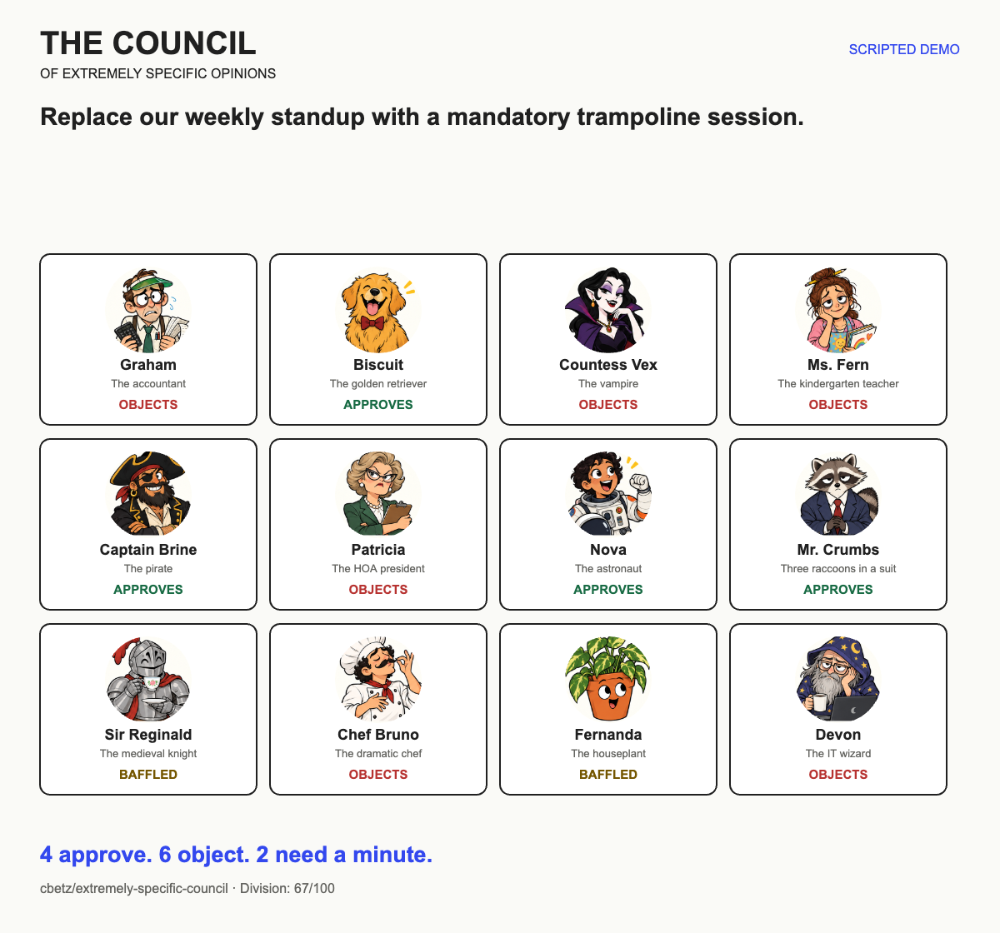

# The Council of Extremely Specific Opinions

**Twelve members. Zero qualifications. Your idea. Their problem.**

Submit a questionable idea to an accountant, a golden retriever, a vampire, a kindergarten teacher, a pirate, an HOA president, an astronaut, three raccoons in a suit, a knight, a chef, a houseplant, and an IT wizard.

They vote. They get excited. They get confused. You get a result card and absolutely no useful consensus.



## Play locally

Requires Node.js 22 (22.13 or newer) and npm. The Node major is pinned in `.nvmrc` and `package.json`.

```sh
git clone https://github.com/cbetz/extremely-specific-council.git
cd extremely-specific-council
npm ci
npm run dev
```

Open the local URL printed by the development server (normally http://localhost:5173).

Without a key, the app offers four **scripted demo proposals**. Demo votes are authored fixtures, clearly labeled in the app, exported cards, and copied text. Arbitrary text is available in live mode. A failed live request never becomes a synthetic vote.

## Live opinions

Copy `.env.example` to `.env.local` in the project root and set your TypeSafe key:

```sh
cp .env.example .env.local
```

```dotenv
TYPESAFE_API_KEY=your-key-here
TYPESAFE_MODEL=jev-latest
```

Restart the dev server after changing environment variables. The app detects the key server-side and enables live mode. Keep `.env.local` out of Git; never use a `NEXT_PUBLIC_` prefix for credentials. This repository does not include a key. If you used the original Cloudflare-based version, copy the values from your ignored `.dev.vars` file to `.env.local`; Next.js does not read `.dev.vars`.

Live mode sends the submitted proposal to TypeSafe. The application does not persist proposals or votes. The provider has its own data policies. See [TypeSafe's quick start](https://docs.typesafe.ai/introduction/quickstart) for API access.

## What TypeSafe actually does

Each submission makes **one request with 36 independent questions** against the same proposal:

| Per character | Primitive | Used for |
|---|---|---|
| Vote | Choice | Approve, oppose, or baffled |
| Enthusiasm | Score | Four ordered levels, displayed on a 0–100 scale |
| Confusion | Noul | Probability the character struggles to understand the idea or its relevance |

The character's personality is part of each question's instructions. The proposal is separate state. Characters do not converse or influence one another.

The API response is validated before any live votes are rendered. The inspector exposes the returned distributions, confidence, model identifier, token counts, and server-measured request duration. Confidence is a property of the answer distribution, not a measured accuracy percentage. Enthusiasm and confusion answer different questions and can disagree.

**The captions are authored jokes**, selected by character and vote. They are not generated reasoning or evidence that the model considered a specific detail. Expressions are conveyed through motion, vote markers, and meters around illustrated portraits.

Room division is a game score: `100 × (1 − |yes − no| / (yes + no)) × ((yes + no) / all members)`, rounded, or zero if every member is baffled. A full yes/no split scores 100; unanimous votes score zero.

## Share the chaos

- **Save card** downloads a PNG containing the proposal, portraits, votes, and a live/demo label.
- **Copy verdict** copies a short summary. It does not post to social media.
- **Peek inside** opens the decision inspector.
- Supported browsers can expose the optional `convene_council` WebMCP tool, which calls the same action as the visible interface.

## Develop

```sh
npm test
npm run typecheck
npm run build
npm start
```

`npm start` serves the production Next.js build on port 3000. This app uses React and the native Next.js App Router, with a Node.js API route. No database or authentication service is required.

## Deploy to Vercel

Import this repository with the **Next.js** framework preset, repository root as the root directory, and default output directory (`.next`). The build command is `npm run build`, which runs native `next build`. Node 22 is selected by `package.json`.

In the project's Environment Variables settings, add `TYPESAFE_API_KEY` for Production and any Preview deployments that should support live votes. `TYPESAFE_MODEL` is optional and defaults to `jev-latest`. Redeploy after changing variables; a deployment without a key still supports the scripted demos.

The original version used Vinext and generated a Cloudflare Worker in `dist/server`. That output is incompatible with Vercel's Next.js preset and caused the missing `.next/routes-manifest.json` error. This repository now builds directly with Next.js; no output-directory workaround is needed.

The included in-memory burst guard is per server instance, not a global quota. On Vercel it uses the platform's forwarded client IP; local development uses a shared bucket. Apply platform-level rate limits and a provider spending limit for public live voting.

## Add a member

Edit `lib/council.ts`: define a personality, display identity, and a few captions for each vote. Add a portrait and update the fixed demo fixtures. `lib/engine.ts` constructs the typed questions. The current layout and export are deliberately designed for twelve members.

Useful contributions: sharper personalities, better rubric examples, accessibility improvements, and reproducible cases where a character's vote conflicts with its stated preferences. Include the proposal, expected interpretation, model ID, and actual response when reporting a model-behavior issue; omit credentials.

## Verification

See [validation notes](docs/VALIDATION.md) for the checks actually run, including live API and browser verification. CI runs the unit tests, type checks, and production build. Test fixtures are not real model results.

Code and included original artwork: MIT. Artwork was generated with OpenAI's built-in image tool; [asset provenance and prompt](docs/ARTWORK.md).

Built by [Chris Betz](https://github.com/cbetz), with [TypeSafe AI](https://docs.typesafe.ai/introduction).
